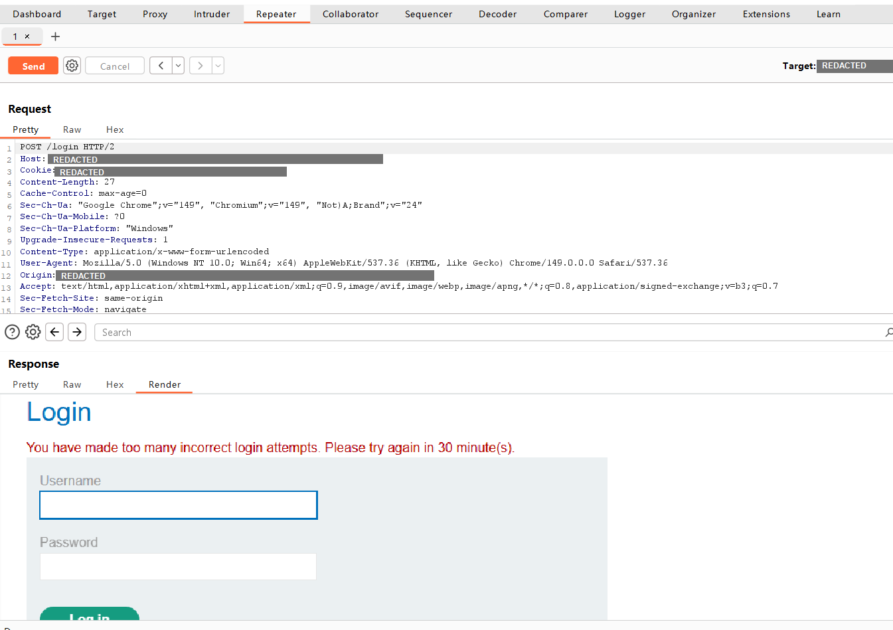
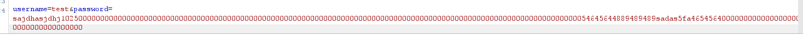
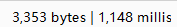
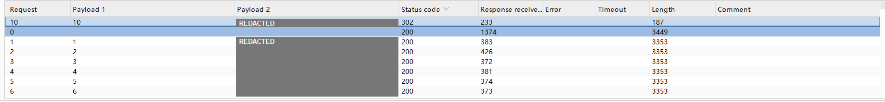

# 基于响应时间的用户名枚举

**中文** | [English](./01.Username%20enumeration%20via%20response%20timing.en.md)

> **实验平台：** PortSwigger Web Security Academy  
> **漏洞类别：** 身份认证 / 用户名枚举  
> **测试工具：** Burp Suite  
> **测试范围：** 本文仅记录授权实验环境中的验证过程。

## 一、漏洞概述

该登录接口存在基于响应时间的用户名枚举问题。

当输入的用户名不存在时，服务器会快速返回登录失败结果；当用户名真实存在但密码错误时，服务器仍会进入密码验证流程，因此响应时间会明显增加。

攻击者可以通过比较不同用户名对应的响应时间，推测哪些账户真实存在。

此外，实验环境还将客户端提供的 `X-Forwarded-For` 请求头作为登录限制依据。攻击者可以修改该字段伪造来源地址，从而绕过仅基于来源地址的登录失败限制。

## 二、测试思路

本次测试主要分为四个阶段：

1. 确认系统是否存在登录失败次数限制；
2. 验证 `X-Forwarded-For` 是否可以绕过限制；
3. 使用超长密码验证用户名存在与否是否会产生明显时间差；
4. 枚举真实用户名后，进一步寻找正确密码。

## 三、测试过程

### 1. 确认登录失败限制

首先使用任意错误账号和密码多次提交登录请求。

当失败次数达到一定阈值后，服务器返回提示，说明系统已对当前来源地址实施临时限制。

```text
登录失败次数过多，请在 30 分钟后重试。
```

这表明系统使用来源地址作为登录失败次数的判断依据。



### 2. 绕过基于来源地址的限制

将登录请求发送至 Burp Suite 的重放模块，并添加以下请求头：

```http
X-Forwarded-For: 1.1.1.1
```

重新发送请求后，原本的限制提示消失，服务器恢复普通登录失败响应。

这说明应用程序错误信任了客户端提交的 `X-Forwarded-For` 值，并将其作为安全控制依据。攻击者可以不断修改该字段，使服务器误认为请求来自不同地址，从而绕过限制。


### 3. 验证响应时间差异

为确认用户名存在与否是否会影响响应时间，先使用一个不存在的用户名作为对照，并输入一段较长的密码。

随后保持密码不变，将用户名替换为实验室提供的已知真实用户名。

测试结果如下：

| 用户名 | 密码长度 | 响应时间 |
|---|---:|---:|
| `test` | 约 100 个字符 | 约 200 毫秒 |
| `wiener` | 约 100 个字符 | 约 1150 毫秒 |

可以看到，真实用户名对应的响应时间明显更长。

这说明服务器在处理真实用户名时进入了额外的密码验证流程，因此响应时间可以作为判断用户名是否存在的侧信道信息。






### 4. 枚举真实用户名

将请求发送至 Burp Suite 的批量测试模块，并同时设置两个变量：

- 第一个变量：修改 `X-Forwarded-For` 中的最后一段地址；
- 第二个变量：导入实验室提供的用户名列表；
- 密码保持为固定的超长字符串，用于放大响应时间差异。

测试结果中，大多数用户名对应的响应时间约为 200 至 400 毫秒。

其中，用户名 `apple` 的响应时间明显更长，约为 1482 毫秒。

因此可以判断：

```text
真实用户名：apple
```


### 5. 寻找正确密码

确认真实用户名后，将用户名固定为 `apple`，仅对密码参数进行批量测试。

判断依据如下：

| 返回状态 | 含义 |
|---|---|
| `200` | 登录失败 |
| `302` | 登录成功后发生跳转 |

在结果中，返回状态为 `302` 的请求对应正确密码。



## 四、漏洞根因

该问题主要由以下三个因素共同导致：

1. **认证流程不一致**  
   不存在的用户名会被直接拒绝，而真实用户名会进入密码验证流程，造成可测量的响应时间差异。

2. **错误信任客户端请求头**  
   服务端直接使用客户端可控的 `X-Forwarded-For` 进行安全判断，导致攻击者能够伪造来源地址。

3. **登录限制策略单一**  
   系统仅依赖来源地址限制失败登录，没有结合账号、会话、设备或行为特征进行综合判断。

## 五、安全影响

攻击者可以利用该问题确认真实用户名，并进一步提高以下攻击的成功率：

- 密码爆破；
- 凭证填充；
- 针对特定账户的钓鱼攻击；
- 针对高权限账户的定向攻击。

## 六、修复建议

### 1. 统一用户名存在与不存在时的认证流程

服务端不应在发现用户名不存在后立即返回结果。否则，用户名是否存在会导致不同的处理路径和响应时间。

建议做法是：无论用户名是否存在，都执行一次密码哈希校验。

```python
user = find_user(username)
if user is None:
    password_hash = DUMMY_PASSWORD_HASH
else:
    password_hash = user.password_hash

is_valid = verify_password(password, password_hash)
if user is None or not is_valid:
    return "用户名或密码错误"
```

其中，`DUMMY_PASSWORD_HASH` 应是系统预先生成并固定保存的哈希值。这样，即使用户名不存在，服务端也会执行与真实用户相近的密码验证流程，从而降低响应时间差异。

同时，前端和后端都应统一返回错误信息，例如：

```text
用户名或密码错误
```

不要分别返回“用户名不存在”“密码错误”等不同提示。

### 2. 不信任客户端直接提交的 `X-Forwarded-For`

`X-Forwarded-For` 应由受控的反向代理或负载均衡器设置，而不能直接相信客户端提交的值。

例如，在 Nginx 反向代理中，可以覆盖客户端原有的请求头：

```nginx
proxy_set_header X-Forwarded-For $remote_addr;
proxy_set_header X-Real-IP $remote_addr;
```

这样，即使攻击者自行提交：

```http
X-Forwarded-For: 1.1.1.1
```

应用服务器接收到的仍然是由 Nginx 写入的真实来源地址，而不是攻击者伪造的内容。

应用程序还应限制“可信代理”范围：只有来自公司负载均衡器、网关或反向代理的请求，才允许其传递真实客户端地址。不应让互联网用户直接访问应用服务器，否则攻击者仍可能绕过代理层伪造请求头。

### 3. 使用多维度登录限制，而不是只限制来源地址

仅依据来源地址进行登录限制容易被伪造请求头、代理服务器或分布式攻击绕过。

建议同时记录以下维度：

```text
账号名 + 来源地址 + 会话标识 + 设备标识
```

例如，可以设计如下规则：

| 触发条件 | 防护措施 |
|---|---|
| 同一账号连续失败 5 次 | 暂时锁定该账号 15 分钟 |
| 同一来源地址短时间内失败过多 | 限制该地址的请求频率 |
| 同一账号从多个地址快速尝试登录 | 增加验证码或要求二次验证 |
| 检测到异常设备或异常地区登录 | 要求多因素认证 |

需要注意：账号不存在时，也应按照相同规则记录失败次数，避免攻击者通过限流行为反向判断账号是否真实存在。

### 4. 对异常登录增加渐进式防护

对于连续失败的登录请求，可以逐步增加防护强度，而不是直接永久封锁。

例如：

| 失败次数 | 防护措施 |
|---|---|
| 第 1 至 3 次失败 | 正常返回错误信息 |
| 第 4 至 5 次失败 | 增加短暂延迟 |
| 第 6 次失败 | 要求验证码 |
| 多次持续失败 | 临时锁定账号并通知用户 |

延迟策略应同时适用于真实用户名和不存在的用户名，避免再次形成时间侧信道。

验证码不建议在第一次失败后立即出现，否则会影响正常用户体验。更适合在短时间内出现多次失败、频繁切换账号或请求行为异常时触发。

### 5. 启用多因素认证并记录异常行为

对于管理员、财务人员和其他高权限账户，应启用多因素认证。

即使攻击者通过用户名枚举或密码爆破获得正确密码，仍需要额外的验证因素才能完成登录。

同时应记录以下安全日志：

- 登录时间；
- 账号名；
- 来源地址；
- 设备信息；
- 失败次数；
- 是否触发验证码；
- 是否触发账户锁定。

当同一账号出现大量失败尝试、短时间内来自多个来源地址的登录，或出现异常地区登录时，应向用户或管理员发送安全告警。

## 七、总结

本实验说明，身份认证接口的风险不仅体现在错误提示内容中，也可能通过响应时间、状态码、页面跳转和登录限制机制等细节泄露账户信息。

在实际测试中，应重点关注：

```text
响应时间、状态码、响应长度、页面跳转和登录限制机制
```

