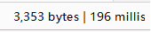
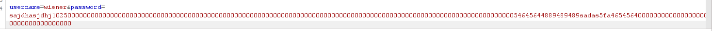
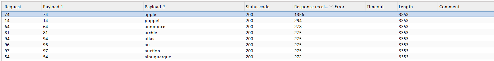

# Username Enumeration via Response Timing

[中文](./01.Username%20enumeration%20via%20response%20timing.md) | **English**

> **Lab platform:** PortSwigger Web Security Academy  
> **Vulnerability type:** Authentication / Username enumeration  
> **Testing tool:** Burp Suite  
> **Scope:** This writeup records the verification process in an authorized lab environment only.

## 1. Vulnerability Overview

The login endpoint is vulnerable to username enumeration through response timing.

When a submitted username does not exist, the server quickly returns a login failure. When the username exists but the password is incorrect, the server still enters the password verification flow, which makes the response time noticeably longer.

An attacker can compare the response times for different usernames and infer which accounts exist.

In addition, the lab environment uses the client-supplied `X-Forwarded-For` request header as part of its login throttling logic. By modifying this header, an attacker can spoof the source address and bypass rate limiting that depends only on the source IP address.

## 2. Testing Approach

The test was divided into four stages:

1. Confirm whether the system enforces a limit on failed login attempts.
2. Verify whether `X-Forwarded-For` can be used to bypass the limit.
3. Use an overlong password to check whether existing and non-existing usernames produce a measurable timing difference.
4. Enumerate the valid username, then identify the correct password.

## 3. Testing Process

### 1. Confirming the Failed Login Limit

First, I submitted multiple login requests using an arbitrary incorrect username and password.

After the number of failures reached a threshold, the server returned a warning, indicating that a temporary restriction had been applied to the current source address.

```text
Too many failed login attempts. Please try again in 30 minutes.
```

This shows that the system uses the source address as the basis for counting failed login attempts.


### 2. Bypassing the Source Address Restriction

I sent the login request to Burp Suite Repeater and added the following request header:

```http
X-Forwarded-For: 1.1.1.1
```

After resending the request, the original rate-limit warning disappeared and the server returned to the normal login failure response.

This indicates that the application incorrectly trusts the client-supplied `X-Forwarded-For` value and uses it as a security control. An attacker can keep changing this field so the server treats the requests as coming from different addresses, bypassing the restriction.


### 3. Verifying the Response Timing Difference

To confirm whether username existence affects response time, I first used a non-existing username as the control case and submitted a long password.

Then I kept the password unchanged and replaced the username with a known valid username provided by the lab.

The results were as follows:

| Username | Password length | Response time |
|---|---:|---:|
| `test` | About 100 characters | About 200 ms |
| `wiener` | About 100 characters | About 1150 ms |

The valid username clearly produced a longer response time.

This suggests that the server enters an additional password verification flow when handling a real username, so response timing can be used as a side channel to determine whether a username exists.






### 4. Enumerating a Suspected Valid Username

I sent the request to Burp Suite Intruder and configured two payload positions:

- The first payload modified the last octet in `X-Forwarded-For`.
- The second payload used the username list provided by the lab.
- The password was kept as a fixed overlong string to amplify the timing difference.
- To reduce the impact of network fluctuations, each request group was sent multiple times, and the result was judged using the majority outcome or the median timing value.

In the results, most usernames produced response times of about 200 to 400 ms.

The username `apple` produced a much longer response time, about 1482 ms.

Therefore, the suspected valid username was:

```text
Suspected valid username: apple
```



It was later confirmed as a valid account by the password test response that returned `302`.

### 5. Finding the Correct Password

After confirming the valid username, I fixed the username as `apple` and brute-forced only the password parameter.

The response status codes were interpreted as follows:

| Status code | Meaning |
|---|---|
| `200` | Login failed |
| `302` | Redirect after successful login |

In the results, the request that returned `302` corresponded to the correct password.


## 4. Root Cause

This issue is mainly caused by three factors:

1. **Inconsistent authentication flow**  
   Non-existing usernames are rejected immediately, while existing usernames enter the password verification flow, creating a measurable timing difference.

2. **Trusting a client-controlled request header**  
   The server directly uses the client-controllable `X-Forwarded-For` header for security decisions, allowing an attacker to spoof the source address.

3. **Single-dimensional login throttling**  
   The system relies only on the source address to limit failed logins, without combining account, session, device, or behavioral signals.

## 5. Security Impact

An attacker can use this issue to identify valid usernames and improve the success rate of follow-up attacks such as:

- Password brute force;
- Credential stuffing;
- Phishing against specific accounts;
- Targeted attacks against privileged accounts.

## 6. Remediation Recommendations

### 1. Make the Authentication Flow Consistent

The server should not immediately return after discovering that a username does not exist. Otherwise, username existence creates different processing paths and different response times.

A safer approach is to always perform a password hash verification, regardless of whether the username exists.

```python
user = find_user(username)
if user is None:
    password_hash = DUMMY_PASSWORD_HASH
else:
    password_hash = user.password_hash

is_valid = verify_password(password, password_hash)
if user is None or not is_valid:
    return "Invalid username or password"
```

`DUMMY_PASSWORD_HASH` should be a pre-generated hash value stored by the system. With this approach, even when the username does not exist, the server still performs a password verification flow similar to the one used for real users, reducing timing differences.

The frontend and backend should also return a unified error message, for example:

```text
Invalid username or password
```

Avoid returning different messages such as "username does not exist" and "incorrect password".

### 2. Do Not Trust Client-Supplied `X-Forwarded-For`

`X-Forwarded-For` should be set by a controlled reverse proxy or load balancer, not trusted directly from the client.

For example, in an Nginx reverse proxy, overwrite any client-supplied header:

```nginx
proxy_set_header X-Forwarded-For $remote_addr;
proxy_set_header X-Real-IP $remote_addr;
```

Then, even if an attacker submits:

```http
X-Forwarded-For: 1.1.1.1
```

The application server receives the real source address written by Nginx, not the spoofed value supplied by the attacker.

The application should also restrict the trusted proxy range. Only requests from company load balancers, gateways, or reverse proxies should be allowed to pass through the real client address. Internet users should not be able to access the application server directly, otherwise they may still bypass the proxy layer and forge headers.

### 3. Use Multi-Dimensional Login Throttling

Rate limiting based only on the source address can be bypassed with forged headers, proxy servers, or distributed attacks.

The system should track multiple dimensions together:

```text
Account name + source address + session identifier + device identifier
```

Example rules:

| Trigger condition | Protection measure |
|---|---|
| Same account fails 5 times consecutively | Temporarily lock the account for 15 minutes |
| Same source address has too many failures in a short time | Rate-limit requests from that address |
| Same account is attempted rapidly from multiple addresses | Add CAPTCHA or require step-up verification |
| Abnormal device or location is detected | Require multi-factor authentication |

When an account does not exist, the system should still record failures using the same rules. This prevents attackers from inferring account existence through rate-limiting behavior.

### 4. Add Progressive Protection for Abnormal Login Attempts

For repeated failed login requests, protection can be increased gradually instead of permanently blocking the account immediately.

For example:

| Failed attempts | Protection measure |
|---|---|
| 1 to 3 failures | Return the normal error message |
| 4 to 5 failures | Add a short delay |
| 6 failures | Require CAPTCHA |
| Continued failures | Temporarily lock the account and notify the user |

Delay strategies should apply to both valid and non-existing usernames to avoid creating another timing side channel.

CAPTCHA should not appear immediately after the first failure, because that can harm normal user experience. It is more appropriate when there are multiple failures in a short period, frequent account switching, or abnormal request behavior.

### 5. Enable Multi-Factor Authentication and Log Abnormal Behavior

Multi-factor authentication should be enabled for administrators, finance users, and other privileged accounts.

Even if an attacker obtains the correct password through username enumeration or brute force, an additional verification factor is still required to complete the login.

The system should also record security logs such as:

- Login time;
- Account name;
- Source address;
- Device information;
- Number of failed attempts;
- Whether CAPTCHA was triggered;
- Whether account lockout was triggered.

When the same account has a large number of failed attempts, receives login attempts from multiple source addresses within a short time, or shows abnormal geographic login behavior, the system should send a security alert to the user or administrator.

## 7. Summary

This lab shows that risks in authentication endpoints are not limited to explicit error messages. Account information may also leak through response timing, status codes, page redirects, and login throttling behavior.

During real-world testing, pay special attention to:

```text
Response timing, status codes, response length, redirects, and login throttling mechanisms
```

